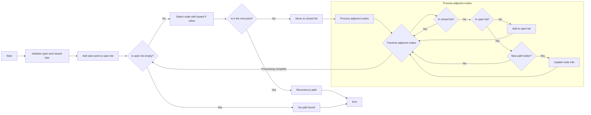

## A* Pathfinding Visualization Demo

This visualization page helps you understand the A* algorithm. Upon loading, you'll see a grid of appropriate size representing the entire "map", with each grid cell representing an equal distance.

Initially, the bottom-left grid cell is selected as the starting point (green flag), and the top-right as the destination (red flag). Some obstacles (gray cells with X) are randomly generated on the map.

Our goal is to **find the shortest path from the start to the end point, avoiding all obstacles**.

You can manually adjust the positions of obstacles, start, and end points, then click the "Find Path" button to view the search process.

The entire search process is demonstrated through animation, with each step's search results marked in different colors. When the shortest path is found, it's marked in green.

During the search, gray and yellow are used to represent the open and closed sets, concepts which will be explained later.

## A* Pathfinding Algorithm

A* is a widely used heuristic pathfinding algorithm. Here, **heuristic means that when finding a path from a certain position, instead of random traversal, it uses known information to estimate the cost of each choice, then selects the direction with the lowest cost**.

The core ideas of the A* pathfinding algorithm are:

1. Use a heuristic function to estimate the cost from the current node to the goal node.
2. Maintain an open list (nodes to be explored) and a closed list (nodes already explored).
3. Always choose the node with the lowest estimated total cost for exploration.

In this page's visualization implementation, a 2D array represents the grid, with each node recording f, g, and h values:

- g-cost: **The actual cost from the start node to the current node, reflecting the cost of the known path**. Usually the number of steps or sum of edge weights along the path. In this page, as the grid cells have equal weight, Manhattan distance is used directly.
- h-cost: **The heuristic estimated value from the current node to the goal node**. This is usually calculated based on some heuristic function (like Manhattan distance, Euclidean distance, etc.).
- f-cost: **The total estimated value from the start node through the current node to the goal node**. f = g + h.

During the search, an open set (nodes to be explored) and a closed set (nodes already explored) are maintained.

- **Open set**: Contains all discovered but not fully evaluated nodes. Initially, only the start node is added.
- **Closed set**: Contains all evaluated nodes. Initially empty.

This way, the algorithm won't re-evaluate already processed nodes, as they're in the closed set. On the other hand, all potential path choices are considered, as they're in the open set.

The overall search steps are as follows: Initially, set the g-value of the start point to 0, calculate the heuristic estimate h from start to end, calculate the f-value of the start point (f = g + h). Put the start point in the open set, and in the main loop, continue searching as long as the open set is not empty.

Each time, select the node with the smallest f-value from the open set as the current node, then traverse all neighbors of the current node:

1. Ignore neighbors already in the closed set;
2. Calculate the g-value to reach the neighbor through the current node from the start;
3. If the neighbor isn't in the open set, add it;
4. If the new path isn't better than the old one, skip;
5. Update the neighbor node's parent, g-value, h-value, and f-value;

Finally, if the open set is empty and no path is found, it means no shortest path exists. If during the search, the node with the smallest f-value is the end point, it means the shortest path is found.

Lastly, just trace back to rebuild the shortest path. During the search process, a parent attribute was set for each explored node, so just reverse traverse the parent attribute.

The overall flow of A* search is shown in the following diagram:

Source code as follows:

## Other

Compared to [Breadth-First Search](/en/algorithms/bfs_path) path, A* algorithm can find the shortest path faster. This is because breadth-first search blindly searches along the path until all possible paths are traversed.

A* algorithm, however, uses a heuristic function to estimate the cost from the current node to the goal node, thus finding the shortest path faster. This difference can be seen in the animation demonstration.

Compared to [Dijkstra's algorithm](/en/algorithms/dijkstra), A* algorithm only finds the shortest path from a specified source to a specified target, not the shortest path tree from a specified source to all possible targets.

This is a necessary trade-off for using a specific goal-oriented heuristic. For Dijkstra's algorithm, since the entire shortest path tree is generated, every node is a target, and it's impossible to have a specific goal-oriented heuristic.