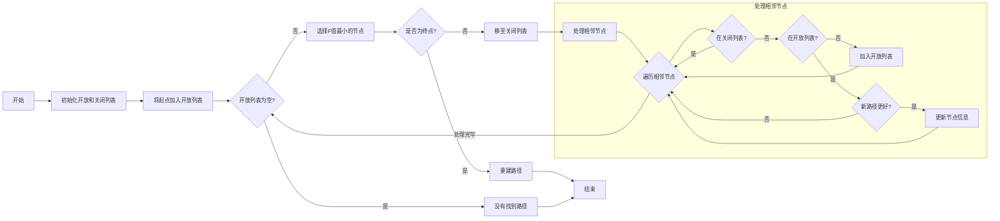

## A* 寻路可视化演示

可以通过本可视化页面来理解 A* 算法。页面加载后会有一个适当大小的网格，里面代表整个“地图”，每个网格代表的距离是相同的。

初始化的时候，会选择左下角网格为开始搜索位置(绿色小旗帜)，右上角为终点位置(红色小旗帜)，然后在地图中随机生成一些障碍物(灰色带 X 的网格)。

我们的目标是**找到从起点到终点的最短路径，并且路径上不能有障碍物**。

可以手动调整障碍物、起点和终点位置，然后点击“查找路径”按钮，查看搜索过程。

整个搜索过程会用动画演示，每一步的搜索结果会用不同的颜色标记。当最后找到一个最短路径后，会用绿色标记整条路径。

搜索过程中，还会用灰色和黄色来表示开放集和关闭集，这两个概念稍后解释。

## A* 寻路算法

A* 算法是一种广泛使用的启发式寻路算法。这里**启发的意思是说，从某个位置开始找路的时候，不是去随机遍历，而是利用一些已知信息，来估算每种选择的成本，然后选择成本最低的方向**。

A* 寻路算法的核心思想如下：

1. 使用启发式函数来估计从当前节点到目标节点的成本。
2. 维护一个开放列表(待探索的节点)和一个关闭列表(已探索的节点)。
3. 每次选择估计总成本最低的节点进行探索。

本页面可视化实现中，用二维数组表示网格，每个节点记录 f、g、h 值:

- g值(g-cost)：**从起点到当前节点的实际代价，反映已知路径的成本**。通常是路径上的步数或边的权重之和，本页面因为是相同权重格子，所以直接用曼哈顿距离。
- h值(h-cost)：**从当前节点到目标节点的启发式估计值**。启发式估计值通常是基于某种启发式函数(如曼哈顿距离、欧几里得距离等)计算的。
- f值(f-cost)：**从起点经过当前节点到达目标节点的总估计值**。f = g + h。

搜索过程中，会维护一个开放集(待探索的节点)和一个关闭集(已探索的节点)。

- **开放集**：包含所有已发现但尚未完全评估的节点，初始化的时候只用把开始节点加入。
- **关闭集**：包含所有已评估的节点，初始化的时候为空。

这样算法不会重复评估已处理的节点，因为已经处理的都在关闭集中。另一方面，所有潜在的路径选择都被考虑，因为在开放集中。

这样整体搜索的步骤如下：初始化的时候，设置起点的g值为0，计算起点到终点的启发式估计值 h，计算起点的f值(f = g + h)。把起点放到开放集中，在主循环中，只要开放集不为空，就继续搜索。

每次从开放集中选择 f 值最小的节点作为当前节点，然后遍历当前节点的所有邻居：

1. 忽略已在关闭集中的邻居；
2. 计算从起点经过当前节点到达邻居的g值；
3. 如果邻居不在开放集中，将其加入；
4. 如果新路径不比旧路径更好，跳过；
5. 更新邻居节点的父节点、g值、h值和f值；

最后如果开放集为空且未找到路径，则说明不存在最短路径。如果搜索的时候，f值最小的节点是终点，则说明找到最短路径。

最后只需要回溯重建最短路径即可。在搜索过程中，为每个探索的节点设置了 parent 属性，最后反向遍历 parent 属性即可。

整个 A* 搜索的流程如下图所示：

源码如下：

## 其他

和[广度优先搜索](/zh/algorithms/bfs_path)路径相比，A* 算法可以更快地找到最短路径。因为广度优先搜索是盲目地沿着路径开始查找，直到遍历所有的可能路径。

而 A* 算法会利用启发式函数来估计从当前节点到目标节点的成本，从而更快地找到最短路径。具体可以从动画演示中看到这点区别。

与[Dijkstra算法](/zh/algorithms/dijkstra)相比，A*算法只找到从指定源到指定目标的最短路径，而不是从指定源到所有可能目标的最短路径树。

这是使用特定目标导向启发式的必要权衡。对于Dijkstra算法，由于生成了整个最短路径树，所以每个节点都是一个目标，并且不可能有特定目标导向的启发式。