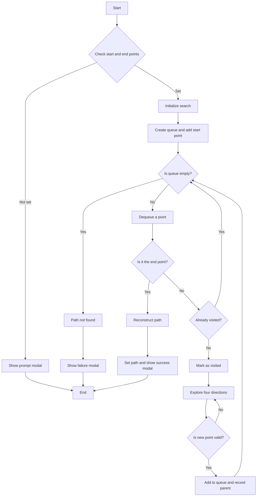

## Open Source Visualization of Breadth-First Search (BFS) Pathfinding Algorithm

This visualization page helps you understand the Breadth-First Search algorithm. Upon loading, you'll see an appropriately sized grid representing the entire "map".

You can move from one grid cell to another along the up, down, left, or right directions. The distance between grid cells is uniform.

Initially, the bottom-left cell is selected as the starting point (green flag), and the top-right cell as the endpoint (red flag). Some obstacles (grey cells with X) are randomly generated on the map.

Our goal is to **find the shortest path from the start to the end point, avoiding all obstacles**.

You can manually adjust the positions of obstacles, start, and endpoints, then click the "Find Path" button to view the search process.

The entire search process is demonstrated with animation, with each step's search result marked in different colors. When a shortest path is found, it's marked in green.

## Breadth-First Search Implementation Steps

Breadth-First Search is a classic graph or tree search algorithm that starts from the initial point and explores all neighboring nodes layer by layer until it finds the target node or traverses the entire graph.

The algorithm steps are relatively simple:

1. Create a queue, add the starting point to the queue, create a set to record visited nodes, and use a Map to record each node's parent node for path reconstruction;
2. While the queue is not empty, remove the first element. If the current node is the endpoint, end the search and reconstruct the path; if not, explore adjacent nodes. For each valid adjacent node (in this example, within the grid, not an obstacle, and unvisited), add it to the queue and record its parent node;

The core implementation pseudocode is as follows. This implementation is open source, and the complete visualization demo code can be found on Github:

```javascript
const queue = [[start.x, start.y]];
const visitedSet = new Set();
const parent = new Map();

while (queue.length > 0) {
    const [x, y] = queue.shift();
    // Check if the endpoint is reached
    if (x === end.x && y === end.y) {
    // Reconstruct path
    // ...
    }

    // Mark current node as visited
    visitedSet.add(`${x},${y}`);

    // Explore four directions
    for (const [dx, dy] of directions) {
    const nx = x + dx;
    const ny = y + dy;
    // Check if the new node is valid
    if (isValidNode(nx, ny)) {
        queue.push([nx, ny]);
        parent.set(`${nx},${ny}`, `${x},${y}`);
    }
    }
}
```

Using the Breadth-First Search algorithm guarantees finding the shortest path. However, it has a relatively high space complexity as it needs to store all visited nodes. For large graphs, exploring a large number of nodes can slow down the search speed.

## Breadth-First Algorithm Visualization Flowchart

The overall steps of the algorithm in this visualization page are shown in the following flowchart:


Flowchart source code:



## Other Considerations

Compared to the [A* algorithm](/en/algorithms/astar), Breadth-First Search blindly traverses all possible paths.

A* algorithm, on the other hand, uses a heuristic function to estimate the cost from the current node to the target node, thus finding the shortest path more quickly. You can see the difference in the animated demonstrations of these two search algorithms.

