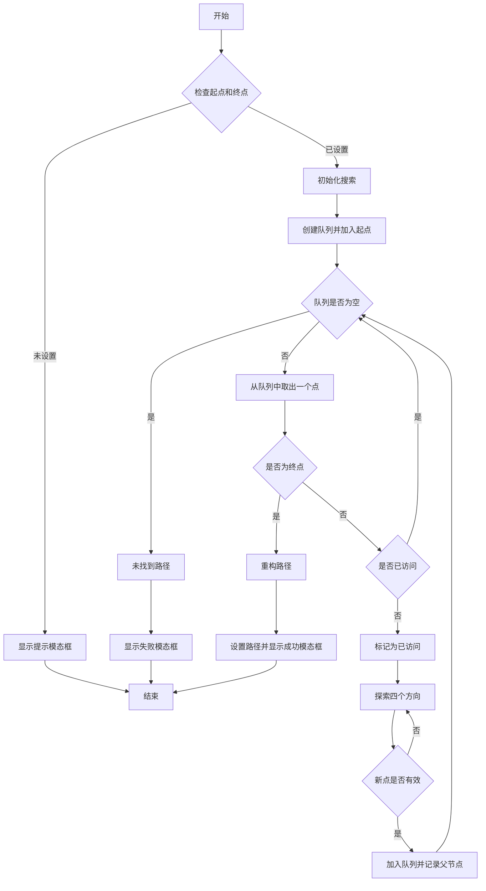

## 广度优先搜索(BFS)寻路算法开源可视化演示

可以通过本可视化页面来理解广度优先搜索算法。页面加载后会有一个适当大小的网格，里面代表整个“地图”。

可以从一个网格沿着上、下、左、右方向移动到另外一个方格，网格之间距离是相同的。

初始化的时候，会选择左下角网格为开始搜索位置(绿色小旗帜)，右上角为终点位置(红色小旗帜)，然后在地图中随机生成一些障碍物(灰色带 X 的网格)。

我们的目标是**找到从起点到终点的最短路径，并且路径上不能有障碍物**。

可以手动调整障碍物、起点和终点位置，然后点击“查找路径”按钮，查看搜索过程。

整个搜索过程会用动画演示，每一步的搜索结果会用不同的颜色标记。当最后找到一个最短路径后，会用绿色标记整条路径。

## 广度优先搜索实现步骤

广度优先搜索是一种经典的图或者树搜索算法，它从起点开始，逐层探索所有相邻节点，直到找到目标节点或遍历完整个图。

算法的步骤比较简单，如下：

1. 创建一个队列，将起点加入队列，创建一个集合记录已访问的节点，使用 Map 记录每个节点的父节点，用于重构路径；
2. 当队列不为空时，取出队首元素。如果当前节点是终点，则结束搜索，重构路径；如果不是终点，则探索相邻节点。对于每个有效的相邻节点（本页面例子中就是在网格内、非障碍物、未访问），将其加入队列，并记录其父节点；

核心实现伪代码如下，本实现开源，完整可视化演示代码可以在 Github 看到：

```javascript
const queue = [[start.x, start.y]];
const visitedSet = new Set();
const parent = new Map();

while (queue.length > 0) {
    const [x, y] = queue.shift();
    // 检查是否到达终点
    if (x === end.x && y === end.y) {
    // 重构路径
    // ...
    }

    // 标记当前节点为已访问
    visitedSet.add(`${x},${y}`);

    // 探索四个方向
    for (const [dx, dy] of directions) {
    const nx = x + dx;
    const ny = y + dy;
    // 检查新节点是否有效
    if (isValidNode(nx, ny)) {
        queue.push([nx, ny]);
        parent.set(`${nx},${ny}`, `${x},${y}`);
    }
    }
}
```

使用广度优先算法，可以保证找到最短路径。不过空间复杂度较高，需要存储所有已访问的节点。图比较大的时候，要探索大量节点，搜索速度可能会很慢。

## 广度优先算法可视化流程图

本可视化页面的算法整体步骤如下流程图：


流程图源码:



## 其他

和[A*算法](/zh/algorithms/astar)相比，广度优先搜索是盲目地遍历所有可能路径。

而 A* 算法会利用启发式函数来估计从当前节点到目标节点的成本，从而更快地找到最短路径。可以从两种搜索算法的动画演示中看到区别。